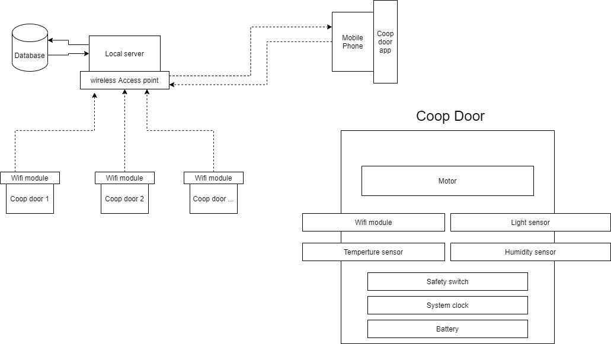

# Exam Part 3 – Architectural Design

<!--====================  START: Insert your Student ID  =================  -->
> Student ID: UP937317
<!--====================  END:   Insert your Student ID  =================  -->

a) Draw ONE architectural diagram that captures all the components of the
SCRAMBLES Ltd scenario. Include at least the following components: Mobile phone
app, Coop Door, Temperature logger.

b) Provide a short description of the component relationships. This can be
either as a separate table or shown as labels on the architectural diagram.

c) Describe in fewer than **50** words:

* one limitation that your chosen architecture imposes on the SCRAMBLES
  coop door

OR

* one feature your chosen architecture enables. For example a feature
  that will help SCRAMBLES Ltd sell more coop doors. It must be a new feature
  that is not listed in the scenario and must be a feature that the end user
  needs.

***[20 Marks]***

<!--==============  START:   Edit the Markdown below here  ==============  -->

a,b)

c)

Our architeture design has a sigle point of failure. If local server on the farm dies, for any reason, system will stop completly working and would need our professional to have a look at it.

<!--==============  END:   Edit the Markdown above here  ================  -->