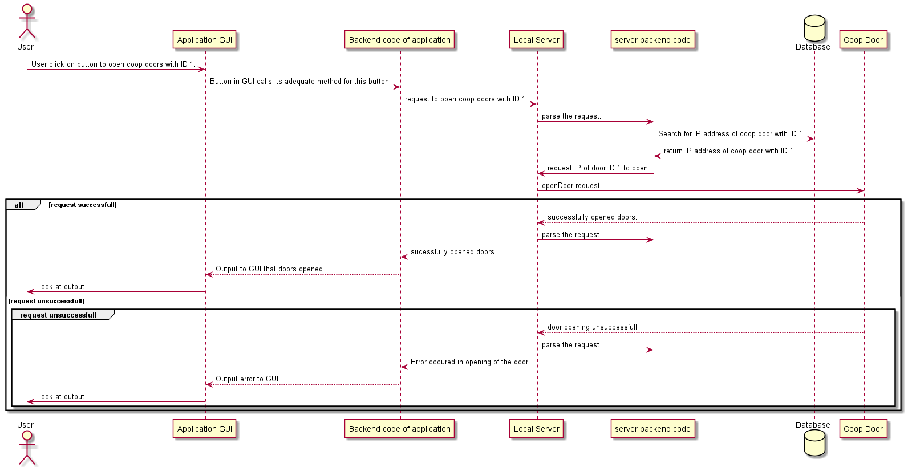

# Exam Part 5 - System Modeling

<!--====================  START: Insert your Student ID  =================  -->
> Student ID: UP937317
<!--====================  END:   Insert your Student ID  =================  -->

Draw a sequence diagram for the “Mobile application, Open Coop Door button” use case. Your diagram must show the calls between components as function calls and
include a minimum of one alternative/error case.

***[15 Marks]***

<!--==============  START:   Edit the Markdown below here  ==============  -->

<!--==============  END:   Edit the Markdown above here  ================  -->