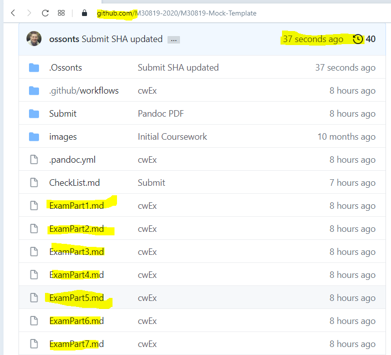

# **Software Engineering Theory and Practice**

|  School of Computing |  |
| --------------- | --------------- |
| Title | Software Engineering Theory and Practice |
| Module Coordinator| Steven Ossont|
| Email | steven.ossont@port.ac.uk|
| Code | M30819|
| Moodle | [https://moodle.port.ac.uk/course/view.php?id=11429](https://moodle.port.ac.uk/course/view.php?id=11429) |

## Schedule and Deliverables

| Item | Value | Format | Outcomes | Start Time | End Time (All) | End Time (Additional Support) |
| --- | --- | --- | --- | --- | -- | -- |
| Mock Exam | 0% | GitHub | % |  14:00:00 18-May-2021 | 16:00:00 18-May-2021 | 16:22:30 18-May-2021 |

* **Duration** :
  * 90 min + 30 min time to submit [Git add/commit/pull/push].
    * **[Total: 120 min]**

* **Additional Support Duration** :
  * 112.5 min [25% extra time] + 30 min time to submit [Git add/commit/pull/push].
    * **[Total: 142.5 min]**

## Notes and Advice

<!-- markdown-link-check-disable -->
* The [Extenuating Circumstances procedure](https://myport.port.ac.uk/my-course/extenuating-circumstances ) is
  there to support you if you have had any circumstances (problems) that have
  been serious or significant enough to prevent you from attending, completing
  or submitting an assessment on time.
* The UNION Extenuating Circumstances [Extenuating Circumstances procedure](https://upsu.net/advice/academic-advice/extenuating-circumstances)
* [ASDAC](https://myport.port.ac.uk/guidance-and-support/additional-support-and-disability-advice )
  are available to any students who disclose a disability or require additional
  support for their academic studies with a good set of resources on the [ASDAC
  Moodle site](https://moodle.port.ac.uk/course/view.php?id=3012)
* The University takes plagiarism seriously. Please ensure you adhere to the
  plagiarism guidelines.
Examination Regulations ([http://regulations.docstore.port.ac.uk/ExamRegs12AssessmentOffences.pdf](http://regulations.docstore.port.ac.uk/ExamRegs12AssessmentOffences.pdf)).
* Any material included should be
  fully cited and referenced in APA format (seventh edition). Detailed advice on
  referencing is available from [http://referencing.port.ac.uk/](http://referencing.port.ac.uk/)
* Any material submitted that does not meet format or submission guidelines, or
  falls outside of the submission deadline could be subject to a cap on your
  overall result or disqualification entirely.
* If you need additional assistance, you can ask your personal tutor, learning
  support ana.baker@port.ac.uk and xia.han@port.ac.uk or your lecturers.
<!-- markdown-link-check-enable-->

## Getting started

If you are reading this, then you have created your private repository and are ready to start the tasks below to complete this exam.

## Submission process

This GitHub repository is your private repository and this is where all parts of the Exam **must** get committed. You should be familiar with Git and GitHub.

In this Exam you will clone this repository, change the existing Markdown (`*.md`)
files and commit & push changes back to this GitHub repository.

You should commit **frequently** and push changes to this github repository often.

This repository will automatically be copied for marking at the Exam deadline.

There are 7 parts to the Exam, all 7 parts must be answered.

If you include a figure/image/diagram, it must be committed to **this** repository.
(Preferably in the images folder). Only images that are visible in the Markdown files will be marked. This means that you must **add** the image to your Markdown
file.

## Recommended workflow

1. `git clone` this GitHub repository.
2. Edit the Markdown files in a text editor. (e.g. VS Code)
3. Save (`git commit`) your files to your git repository (frequently!)
4. Push (`git push`) your commits to GitHub as often as you want! Only the files saved in the GitHub repository will be marked.
5. Remember to `git add` any new files that your create, eg new images.
6. When you think you are done, [double check](#when-you-are-ready-to-submit).

## Scenario

Encouraged by the dramatic increase in non-professional backyard chicken
rearing, SCRAMBLES Ltd have decided to market an automated chicken coop device
designed to simplify the core tasks associated with the safety and wellbeing of
chicken ownership.

The marketing department has identified the target customer as a homeowner
keeping fewer than six chickens in a single coop (Chicken house). The coop is
used to keep the chickens safe from predators overnight, and has a single door
that is opened and closed manually. Chickens are light activated and this means
that the door has to be opened and closed at anti-social hours. For example
opening at 5AM and closing at 10PM, in the summer.

SCRAMBLES Ltd have designed and built an automatic coop door that can be
attached to any style of coop. The door is mechanically robust and easy to
install and has the following sensors and capabilities:

* An external light sensor (photoresistor) to detect dawn and dusk
* A real time clock to keep accurate time
* An internal temperature and humidity sensor
* A motor to open and close the door
* A safety switch that is activated if the door jams
* A battery capable of 6+ months operation

The device has 3 operating modes:

* Manual – the owner presses a button to activate the door.
* Time – the owner can set a time to open and close the door.
* Light – the owner can set a light level for opening and closing the door. The
  range is 0% dark to 100% light. The default is open at 26% close at 6%.

The SCRAMBLES coop door is undoubtedly a revolutionary device, but the ease of
install and high quality components have dramatically increased the cost.
SCRAMBLES Ltd have decided to WiFi enable the coop door so they can add new
features and market the world’s first Internet of Things chicken coop door. The
WiFi capabilities will enable owners to:

* open/close the coop door using a mobile phone app
* check the status of the door (open/closed)
* switch between operational modes (Manual/Time/Light)
* log the temperature and humidity

SCRAMBLES Ltd are experts in chicken welfare and construction of hardware but
they have had little experience with software projects. The SCRAMBLES coop door
hardware has been built and cannot be modified. It runs a small version of
Python (Micro Python) and the software can be updated. The Python code can call
functions to operate the hardware e.g. OpenDoor(), GetDoorStatus(). You will be
responsible for the software running on the coop door, the mobile phone
application and any supporting software infrastructure.

The current software practices are informal, lack testing and overall planning. You have been
contracted to manage this software project and make the product a success.

## Complete the Exam Parts

Complete all 7 parts of the Exam

1. [Exam Part 1 – Software Configuration Management](ExamPart1.md)
***[10 Marks]***

2. [Exam Part 2 – Software Process Models](ExamPart2.md)
***[15 Marks]***

3. [Exam Part 3 – Architectural Design](ExamPart3.md)
***[20 Marks]***

4. [Exam Part 4 – Testing](ExamPart4.md)
***[15 Marks]***

5. [Exam Part 5 – System Modeling](ExamPart5.md)
***[15 Marks]***

6. [Exam Part 6 – Implementation](ExamPart6.md)
***[15 Marks]***

7. [Exam Part 7 – Reflection](ExamPart7.md)
***[10 Marks]***

## When you are ready to submit

If you think you are complete, ***STOP*** and double check.

* The Exam requires you to submit 7 (SEVEN) Markdown files. Did you edit all
  7 `.md` files?

* As part of the Exam you probably generated images/diagrams/figures.

  * These files should be added and committed to GitHub.
  * They **must** be linked into a Markdown file for the relevant Exam
      part.
  * YOu must use a relative path not a full URL to include images into your Markdown

* You may have forgotten to push your commits (You committed locally but did not
  **push** to GitHub). **Only the Markdown files in GitHub will be marked**.

  * In a web browser go to your GitHub Repository.
  * Make sure you are on the *Master* branch.
  * Click all 7 (SEVEN) of the **ExamPart**[1-7]**.md** files and check they
    display correctly on the Github webpage in a **browser**. (If it does not
    then you probably did not push your commits to GitHub)
  * Check that the last edited time is as expected. Does it have a recent
    timestamp?
  * Make sure you can view your images when your Markdown files are displayed in a browser.

### Submit your exam

Validate that you have completed the [CheckList.md](CheckList.md).

* Failure to `git push` all your completed exam content will count as a non-submit. Go to Github.com and click on every markdown file you have amended and ensure that every change you have made is visible on the GitHub rendered webpage.
* Ensure all completed parts are marked as completed. Use a capital `X`
* When you are completed place a `X` in the final item in the checklist.

You are **not** required to run any GitHub actions for this exam.

## **Your repository will be copied for marking automatically at the Exam deadline.**
